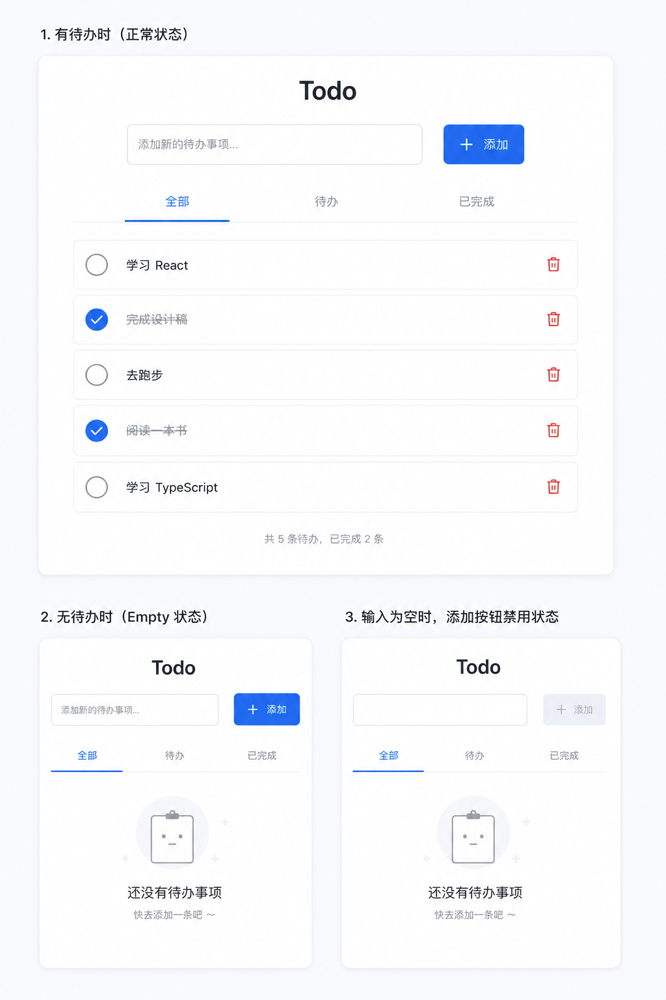

# Harness React Todo

A polished React + TypeScript Todo app with a pre-configured CI-grade harness: linting, type-checking, unit tests, e2e tests, local visual regression screenshots, and a single `verify` command for the full local pipeline.

## Background

This project is intentionally small, but the workflow is production-minded. It is useful as a starting point for AI agent development, UI iteration, and small React projects that need quality gates without a heavy framework.

The app also captures a practical testing lesson: functional e2e tests and screenshot tests have different stability profiles. Functional checks are reliable enough for every CI run. Pixel screenshots are useful for visual iteration, especially when an agent is matching a design, but they are sensitive to the exact rendering environment.

## CI / Visual Testing Lessons

- CI runs on `ubuntu-latest` and executes lint, typecheck, unit tests, and Playwright functional e2e flows.
- Screenshot assertions are skipped when `CI=true`. This keeps pull requests from failing on harmless one-pixel differences caused by runner OS, browser patch versions, fonts, anti-aliasing, or subpixel rendering.
- Local `pnpm e2e` still runs screenshot assertions. Agents and developers can use this as a fast visual feedback loop while refining UI.
- Snapshot updates should be intentional: run `pnpm e2e --update-snapshots` only after a deliberate visual change.
- For a team-wide visual regression gate, use one reproducible visual environment, such as a pinned Docker image or a dedicated CI visual job. Avoid mixing baselines generated from different developer machines.

Current policy:

```text
CI:    stable behavior checks, no screenshot assertions
Local: behavior checks + screenshot assertions for visual iteration
```

## Design Reference

The Todo UI follows this design, including the default list, empty state, and disabled add-button state for blank input.



## App Features

- Chinese Todo interface matching the provided design
- Default task list with active and completed items
- Add todos by button click or Enter key
- Toggle completion state
- Delete individual todos
- Filter by `全部`, `待办`, and `已完成`
- Live summary of active and completed counts
- Local Playwright screenshot coverage for visual fidelity

## Tech Stack

| Layer | Choice |
|---|---|
| Framework | React 19 |
| Language | TypeScript 6 |
| Bundler | Vite 8 |
| Package Manager | pnpm |
| Unit Testing | Vitest + React Testing Library |
| E2E Testing | Playwright functional flows + local screenshot snapshots |
| Linter | ESLint 10 (flat config) |

## Prerequisites

- **Node.js** >= 18
- **pnpm** >= 9 (`npm install -g pnpm`)

## Quick Start

```bash
pnpm install

pnpm dev
```

Open [http://localhost:5173](http://localhost:5173).

For a production build:

```bash
pnpm build
```

## Available Scripts

| Script | Description |
|---|---|
| `pnpm dev` | Start Vite dev server with HMR |
| `pnpm build` | Type-check + production build |
| `pnpm preview` | Preview the production build locally |
| `pnpm lint` | Run ESLint on all source files |
| `pnpm typecheck` | Run TypeScript compiler checks (`tsc -b`) |
| `pnpm test` | Run Vitest unit tests |
| `pnpm e2e` | Run Playwright e2e tests (auto-starts dev server; local runs include screenshots) |
| `pnpm verify` | **Full pipeline:** lint → typecheck → test → e2e |

## Project Structure

```
harness-react-demo/
├── e2e/                    # Playwright e2e tests
│   ├── todo.spec.ts        #   Todo app e2e test suite
│   └── todo.spec.ts-snapshots/
│       ├── todo-default-darwin.png
│       └── todo-empty-darwin.png
├── public/                 # Static assets (favicon, icons)
├── src/                    # Application source
│   ├── assets/             #   Image assets
│   ├── App.tsx             #   Root component
│   ├── App.css             #   Root styles
│   ├── App.test.tsx        #   App component unit test
│   ├── Todo.tsx            #   Todo component
│   ├── Todo.css            #   Todo styles
│   ├── Todo.test.tsx       #   Todo component unit test
│   ├── index.css           #   Global styles
│   ├── main.tsx            #   Entry point
│   └── setupTests.ts       #   Vitest setup (@testing-library/jest-dom)
├── eslint.config.js        # ESLint flat config
├── playwright.config.ts    # Playwright configuration
├── tsconfig.json           # Root TS config (references)
├── tsconfig.app.json       # App TS config
├── tsconfig.node.json      # Node/CLI TS config (vite.config.ts)
├── tsconfig.e2e.json       # E2E test TS config
└── vite.config.ts          # Vite + Vitest configuration
```

## Testing

### Unit Tests

Located next to each component as `*.test.tsx`. Uses Vitest with jsdom and React Testing Library.

The Todo unit tests cover default rendering, adding todos, blank input handling, completion toggles, filters, deletion, and summary counts.

```bash
pnpm test
```

Example test pattern:

```tsx
import { render, screen, fireEvent } from '@testing-library/react'
import { describe, it, expect } from 'vitest'
import Todo from './Todo'

describe('Todo', () => {
  it('adds a todo', () => {
    render(<Todo />)
    fireEvent.change(screen.getByPlaceholderText('添加新的待办事项...'), {
      target: { value: '整理会议纪要' },
    })
    fireEvent.click(screen.getByRole('button', { name: '添加' }))
    expect(screen.getByText('整理会议纪要')).toBeInTheDocument()
  })
})
```

### E2E Tests

Located in `e2e/`. Uses Playwright with Chromium. Playwright's `webServer` config auto-starts the Vite dev server.

The e2e suite covers the main user flows and includes a local screenshot assertion for the default Todo screen.

```bash
pnpm e2e

# Update visual snapshots after intentional UI changes
pnpm e2e --update-snapshots
```

When `CI=true`, screenshot assertions are skipped. CI still runs the same functional e2e flows, but avoids pixel-level visual checks. Even a one-pixel difference can fail a snapshot on GitHub Actions while the UI is functionally unchanged.

For agent or developer visual iteration, use local screenshots as a fast feedback loop:

```bash
pnpm e2e
pnpm e2e --update-snapshots
```

Treat those snapshots as development aids unless the team standardizes a fixed visual test environment. If visual regression testing should become a shared merge gate, run it in one reproducible environment and update snapshots only from that environment.

Example test pattern:

```ts
import { test, expect } from '@playwright/test'

test('adds a todo', async ({ page }) => {
  await page.goto('/')
  await page.getByPlaceholder('添加新的待办事项...').fill('整理会议纪要')
  await page.getByRole('button', { name: '添加' }).click()
  await expect(page.getByText('整理会议纪要')).toBeVisible()
})
```

### Full Pipeline

```bash
pnpm verify
```

Runs lint, typecheck, unit tests, and e2e tests. In CI, e2e tests skip screenshot assertions and focus on stable behavior checks.

## Adding New Code

1. Create or update the component and its CSS.
2. Add or update a nearby `*.test.tsx` unit test.
3. Add or update a Playwright spec in `e2e/` for full-page behavior.
4. Update screenshot snapshots when the visual change is intentional.
5. Run `pnpm verify` before committing.

---

Scaffolded with `pnpm create vite` using the `react-ts` template.
